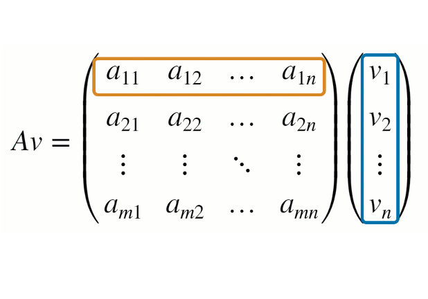
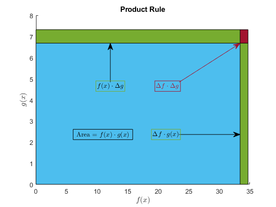
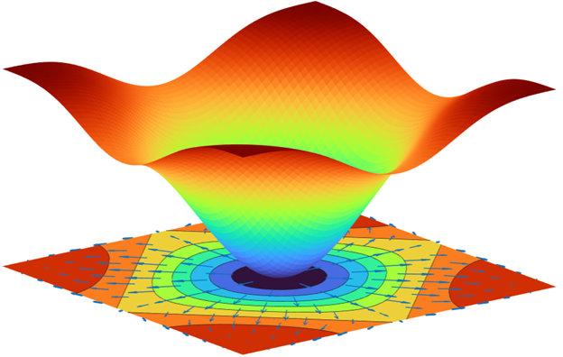
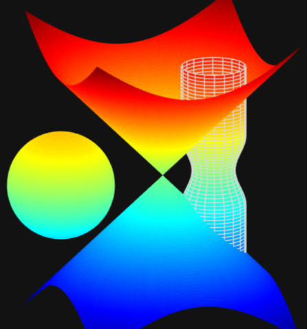
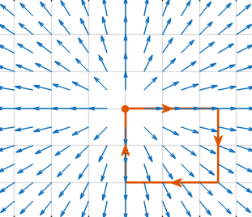

# Multivariable Calculus: Derivatives

 or 

**Curriculum Module**

_Created with R2026a. Compatible with R2026a and later releases._

# Information

This curriculum module contains interactive [MATLAB® live scripts](https://www.mathworks.com/products/matlab/live-editor.html) that teach and apply standard concepts for multivariable derivatives.

## Background

You can use these live scripts as demonstrations in lectures, class activities, or interactive assignments outside class. This module covers partial derivatives with applications to machine learning and computer vision. 

The instructions inside the live scripts will guide you through the exercises and activities. Get started with each live script by running it one section at a time. To stop running the script or a section midway (for example, when an animation is in progress), use the  Stop button in the **RUN** section of the **Live Editor** tab in the MATLAB Toolstrip.

## Contact Us

Contact the [MathWorks teaching resources team](mailto:onlineteaching@mathworks.com) if you would like to to request assistance, provide feedback, or if you have a question.

## Prerequisites

This module assumes knowledge of single variable calculus, vectors, including vector fields, and matrices, including determinants, as covered in the courseware listed here:

| **Courseware Module**    | **Sample content**    | **Available on:**     |
| :-- | :-- | :-- |
| [Matrix Methods of Linear Algebra](https://www.mathworks.com/matlabcentral/fileexchange/94730-matrix-methods-of-linear-algebra)    |     |       [GitHub](https://github.com/MathWorks-Teaching-Resources/Matrix-Methods-of-Linear-Algebra)     |
| [Calculus: Derivatives](https://www.mathworks.com/matlabcentral/fileexchange/99249-calculus-derivatives)     |     |        [GitHub](https://github.com/MathWorks-Teaching-Resources/Calculus-Derivatives)      |

## Getting Started

### Accessing the Module

### **On MATLAB Online:**

Use the  link to download the module. You will be prompted to log in or create a MathWorks account. The project will be loaded, and you will see an app with several navigation options to get you started.

### **On Desktop:**

Download or clone this repository. Open MATLAB, navigate to the folder containing these scripts and double\-click [Derivatives.prj](<matlab: openProject("Derivatives.prj")>). It will add the appropriate files to your MATLAB path and open an app that asks you where you would like to start. 

Ensure you have all the required products ([listed below](#H_E850B4FF)) installed. If you need to include a product, add it using the Add\-On Explorer. To install an add\-on, go to the **Home** tab and select  **Add-Ons** > **Get Add-Ons**. 

## Products

MATLAB® and Symbolic Math Toolbox™ are used throughout. Tools from the Image Processing Toolbox™ are used in the computer vision example. The function `randsample` from the Statistics and Machine Learning Toolbox™ is used to create Exercise 5 in the partial derivatives script.

# Scripts

## [PartialDerivatives.m](https://matlab.mathworks.com/open/github/v1?repo=MathWorks-Teaching-Resources/Multivariable-Derivatives&project=Derivatives.prj&file=Scripts/PartialDerivatives.m) 
||||
| :-- | :-- | :-- |
|     | **In this script, students will...**   $\bullet$ Compute and visualize partial derivatives, directional derivatives, and gradients   $\bullet$ Recognize notation for partial derivatives   $\bullet$ Apply the chain rule for partial derivatives    | **Academic disciplines**   $\bullet$ Machine learning (gradient descent)   $\bullet$ Mathematics   $\bullet$ Computer Vision     |

# License

The license for this module is available in the [LICENSE.md](https://github.com/MathWorks-Teaching-Resources/Multivariable-Derivatives/blob/release/LICENSE.md).

# Related Courseware Modules

| **Courseware Module**    | **Sample Content**    | **Available on:**     |
| :-- | :-- | :-- |
| [Multivariable: Space and Functions](https://www.mathworks.com/matlabcentral/fileexchange/180356-multivariable-space-and-functions)    |     |       [GitHub](https://github.com/MathWorks-Teaching-Resources/Multivariable-Space-and-Functions)     |
| [Multivariable: Integrals](https://www.mathworks.com/matlabcentral/fileexchange/181588-multivariable-integrals)    |     |       [GitHub](https://github.com/MathWorks-Teaching-Resources/Multivariable-Integrals)     |
| [Applied Partial Differential Equations](https://www.mathworks.com/matlabcentral/fileexchange/172650-applied-partial-differential-equations)    |     |       [GitHub](https://github.com/MathWorks-Teaching-Resources/Applied-PDEs)     |

Or feel free to explore our other [modular courseware content](https://www.mathworks.com/matlabcentral/profile/authors/37969341).

# Educator Resources
- [Educator Page](https://www.mathworks.com/academia/educators.html)

# Contribute 

Looking for more? Find an issue? Have a suggestion? Please contact the [MathWorks teaching resources team](mailto:%20onlineteaching@mathworks.com). If you want to contribute directly to this project, you can find information about how to do so in the [CONTRIBUTING.md](https://github.com/MathWorks-Teaching-Resources/Multivariable-Derivatives/blob/release/CONTRIBUTING.md) page on GitHub.

*©* Copyright 2026 The MathWorks, Inc
